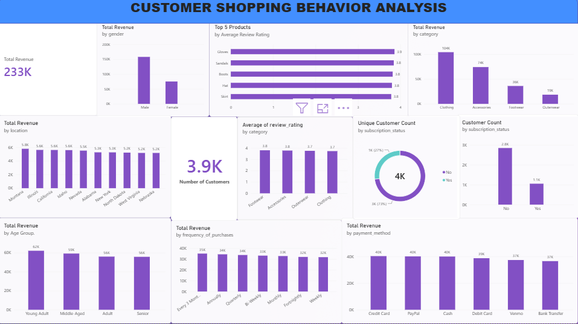

# Customer Shopping Behavior Analysis

## 📌 Project Overview

Customer Shopping Behavior Analysis is an end-to-end data analytics
project focused on extracting actionable business insights from customer
transaction data.

The project analyzes **3,900+ customer transactions** to understand
purchasing patterns, revenue performance, product ratings, customer
segmentation, discount usage, subscription behavior, demographics, and
payment preferences.

The analysis combines **Python, PostgreSQL, SQL, and Power BI** to
demonstrate a complete data analytics workflow --- from data preparation
and exploratory analysis to SQL-based business analysis and interactive
dashboard development.

------------------------------------------------------------------------

## 🎯 Business Objectives

The primary objectives of this project are to:

-   Analyze overall customer purchasing behavior
-   Identify key revenue-generating customer and product segments
-   Evaluate customer subscription patterns
-   Understand the impact of discounts on purchasing behavior
-   Analyze product ratings and performance
-   Segment customers based on purchasing history
-   Identify purchasing trends across demographics and locations
-   Generate business-ready insights through interactive visualization

------------------------------------------------------------------------

## 🛠️ Technology Stack

  Technology             Purpose
  ---------------------- --------------------------------------------------------
  **Python**             Data cleaning, transformation and exploratory analysis
  **Pandas**             Data manipulation and preprocessing
  **PostgreSQL**         Data storage and analytical querying
  **SQL**                Business analysis and KPI generation
  **Power BI**           Interactive dashboard and data visualization
  **Jupyter Notebook**   Analysis workflow and documentation

------------------------------------------------------------------------

## 🔄 Project Workflow

``` text
Raw Customer Data
       ↓
Data Cleaning & Preprocessing
       ↓
Exploratory Data Analysis
       ↓
PostgreSQL Database
       ↓
SQL Business Analysis
       ↓
Power BI Data Visualization
       ↓
Business Insights
```

------------------------------------------------------------------------

## 📊 Analytical Areas

The project includes **10+ SQL-based business analyses**, including:

### Revenue Analysis

-   Revenue by gender
-   Revenue by age group
-   Revenue by product category
-   Revenue by payment method
-   Revenue by purchase frequency

### Customer Analysis

-   Customer segmentation based on previous purchases
-   Frequent vs. non-frequent buyer behavior
-   Subscription rates among different customer groups
-   Customer distribution by subscription status

### Product Analysis

-   Top products based on average review ratings
-   Top products within each category
-   Discount usage across products

### Purchasing Behavior

-   Discounted purchases and customer spending
-   Standard vs. Express shipping spending
-   Purchase frequency analysis
-   Repeat-purchase behavior

------------------------------------------------------------------------

## 📈 Power BI Dashboard 

An interactive Power BI dashboard was developed to provide a
consolidated view of customer shopping behavior.

### Dashboard Includes

-   **Total Revenue**
-   **Revenue by Gender**
-   **Revenue by Category**
-   **Top 5 Products by Average Review Rating**
-   **Top 10 Locations by Revenue**
-   **Customer Count by Subscription Status**
-   **Average Review Rating by Category**
-   **Revenue by Age Group**
-   **Revenue by Payment Method**
-   **Revenue by Purchase Frequency**

The dashboard enables users to explore customer and revenue patterns
through interactive visualizations.

------------------------------------------------------------------------

## 🔍 Key Project Highlights

-   Analyzed **3,900+ customer transactions**
-   Developed **10+ PostgreSQL SQL analyses**
-   Applied SQL techniques including:
    -   Aggregations
    -   `GROUP BY`
    -   Subqueries
    -   `CASE` statements
    -   Window functions
    -   Ranking
-   Performed customer segmentation using purchasing history
-   Built a Power BI dashboard containing **9+ business-focused
    visuals**
-   Combined Python, SQL, PostgreSQL, and Power BI into an end-to-end
    analytics pipeline

------------------------------------------------------------------------

## 📁 Repository Structure


``` text
Customer-Shopping-Behavior-Analysis/
│
├── customer.ipynb
│       └── Python data cleaning & analysis
│
├── customer_behavior.csv
│       └── Customer transaction dataset
│
├── customer_behavior_analysis.sql
│       └── PostgreSQL business analysis queries
│
├── Customer_Shopping_Behavior_Analysis.pbix
│       └── Power BI interactive dashboard
│
└── README.md
```

------------------------------------------------------------------------
## 📂 Project Files

- 📓 **Python Analysis:** [customer.ipynb](customer.ipynb)
- 🗄️ **SQL Analysis:** [Customer_b.sql](Customer_b.sql)
- 📊 **Power BI Dashboard:** [Customer_behaviour.pbix](Customer_behaviour.pbix)
- 📁 **Dataset:** [customer_shopping_behavior.csv](customer_shopping_behavior.csv)
- 🖼️ **Dashboard Screenshot:** [powerbi_dashboard.png](powerbi_dashboard.png)

## 💡 Business Value

The analysis provides a data-driven view of customer behavior that can
support business decisions related to:

-   Customer retention
-   Subscription growth
-   Marketing campaigns
-   Product strategy
-   Discount optimization
-   Revenue growth
-   Customer segmentation

------------------------------------------------------------------------

## 👨‍💻 Author

**Zahid Rasool**

**Data Analyst \| Python \| SQL \| PostgreSQL \| Power BI**

------------------------------------------------------------------------

## ⭐ Project Skills Demonstrated

`Python` `Pandas` `SQL` `PostgreSQL` `Power BI` `Data Cleaning` `EDA`
`Data Analysis` `Customer Segmentation` `Business Intelligence`
`Data Visualization` `KPI Analysis`
